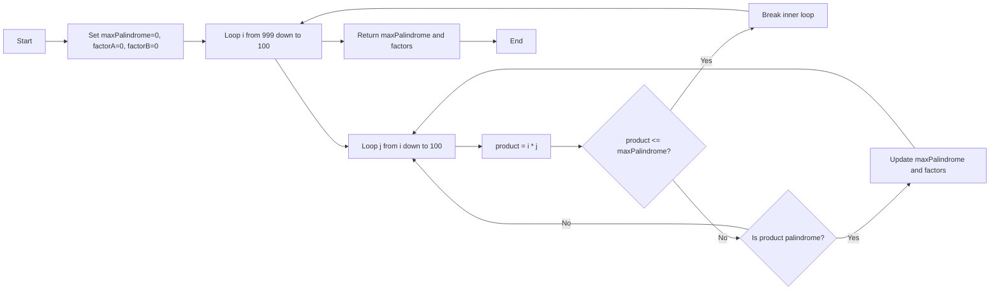

# Interview Answers - PHP Fullstack Staff - Duwi Anjar Ari Wibowo

Name: Duwi Anjar Ari Wibowo  
Email: duwianjarariwibowo@gmail.com  
Phone: 082220649676

## Environment

- Language: PHP
- PHP version used: 8.4.17 (CLI)

## Q1 - Largest Palindrome Product (3-digit x 3-digit)

### Problem Explanation

A palindrome number reads the same from left to right and right to left.
Examples:
- Palindrome: `121`, `1331`, `9009`
- Not palindrome: `123`, `9012`

Task:
- Find the largest palindrome produced by multiplying two 3-digit numbers (`100` to `999`).

### Approach Summary

- Check all multiplication pairs of 3-digit numbers.
- Keep only products that are palindrome.
- Track the largest palindrome value found.

### Logic Diagram (Mermaid)

