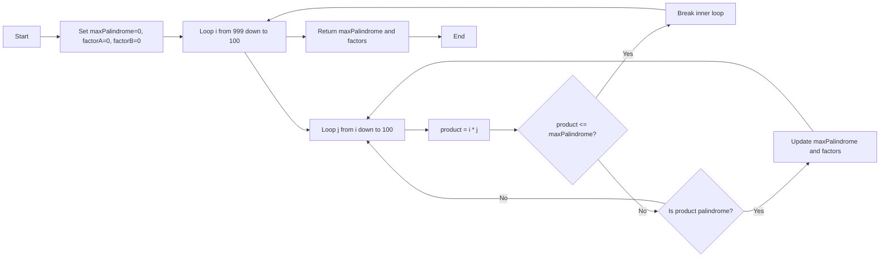
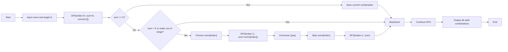
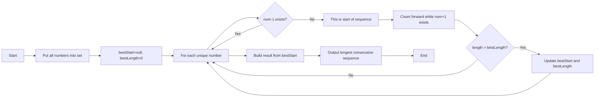
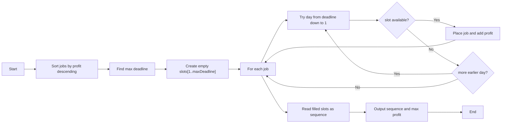

# Interview Answers - PHP Fullstack Staff - Duwi Anjar Ari Wibowo

Name: Duwi Anjar Ari Wibowo  
Email: duwianjarariwibowo@gmail.com  
Phone: 082220649676

## Environment

- Language: PHP
- PHP version used: 8.4.17 (CLI)

## Q1 - Largest Palindrome Product (3-digit x 3-digit)

### Problem Explanation

A palindrome number reads the same from left to right and right to left.
Examples:
- Palindrome: `121`, `1331`, `9009`
- Not palindrome: `123`, `9012`

Task:
- Find the largest palindrome produced by multiplying two 3-digit numbers (`100` to `999`).

### Approach Summary

- Check all multiplication pairs of 3-digit numbers.
- Keep only products that are palindrome.
- Track the largest palindrome value found.

### Logic Diagram (Mermaid)



### Result

Run:

```bash
php q1_palindrome.php
```

Output:

```text
Largest palindrome: 906609
Factors: 993 x 913
```

## Q2 - Combination Sum (Use each element at most once)

### Problem Explanation

Given an integer array and an integer target `K`, find all unique combinations where the sum equals `K`.
Input used:
- `array = [5, 6, 14, 15, 18, 20, 10, 4, 3, 9, 13]`
- `K = 40`

### Approach Summary

- Use backtracking with two choices at every index: pick or skip.
- Save combination when current sum is exactly `40`.
- Stop a branch when sum becomes greater than `40`.

### Logic Diagram (Mermaid)



### Result

Run:

```bash
php q2_combination_sum.php
```

Output summary:
- Total combinations: `24`
- First two combinations found by DFS order:
  - `[5, 6, 14, 15]`
  - `[5, 6, 15, 10, 4]`

## Q3 - Longest Consecutive Sequence

### Problem Explanation

Given an unsorted integer array, find the longest sequence of consecutive numbers without counting duplicates more than once.
Input used:
- `[100, 4, 200, 1, 3, 2, 2, 5, 6]`

Expected longest sequence:
- `[1, 2, 3, 4, 5, 6]`

### Approach Summary

- Put all numbers into a set-like map to remove duplicate effect and allow fast lookup.
- Only start counting from numbers that do not have a predecessor (`num-1`).
- Expand forward (`num+1`) to compute sequence length.

### Logic Diagram (Mermaid)



### Result

Run:

```bash
php q3_longest_consecutive.php
```

Output:

```text
Input: [100, 4, 200, 1, 3, 2, 2, 5, 6]
Longest consecutive sequence: [1, 2, 3, 4, 5, 6]
```

## Q4 - Job Sequencing for Maximum Profit

### Problem Explanation

Each job has:
- `id`
- `deadline`
- `profit`

Rules:
- Each job takes exactly 1 day.
- Only 1 job can be done per day.
- A job contributes profit only if scheduled on or before its deadline.

Goal:
- Choose and schedule jobs to maximize total profit.

### Approach Summary

- Sort jobs by profit descending.
- For each job, place it on the latest available day not exceeding its deadline.
- This keeps earlier slots available for other jobs and maximizes total profit.

### Logic Diagram (Mermaid)


