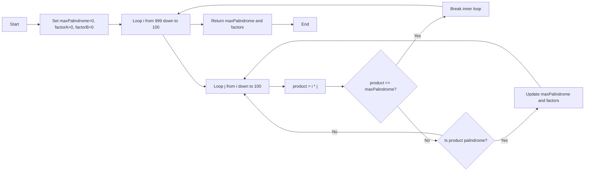
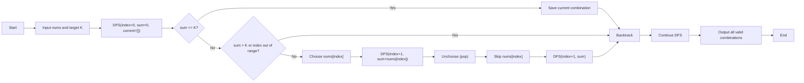
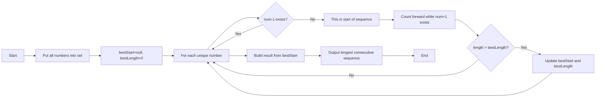
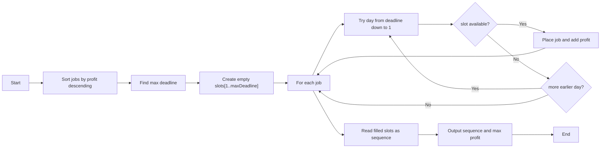
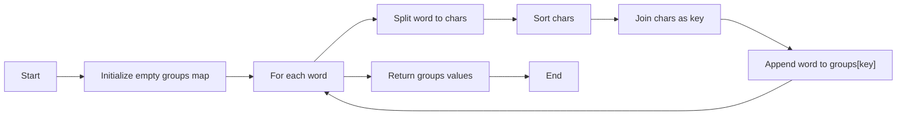

# Jawaban Interview - Staff PHP Fullstack - Duwi Anjar Ari Wibowo

Nama: Duwi Anjar Ari Wibowo  
Email: duwianjarariwibowo@gmail.com  
No. HP: 082220649676

## Keterangan Proyek

Repository ini berisi jawaban soal interview programmer menggunakan PHP, meliputi Q1 sampai Q5.

## Struktur Folder

```text
LIVECODEPHP/
├── README.md
├── interview_tbglobal.php
├── q1_palindrome.php
├── q2_combination_sum.php
├── q3_longest_consecutive.php
├── q4_job_sequencing.php
├── q5_group_anagram.php
└── docs/
    └── logic-diagrams.md
```

## Versi Lingkungan

- Bahasa: PHP
- Versi PHP saat pengerjaan/pengujian: `PHP 8.4.17 (CLI)`

## Cara Menjalankan

Jalankan per soal:

```bash
php q1_palindrome.php
php q2_combination_sum.php
php q3_longest_consecutive.php
php q4_job_sequencing.php
php q5_group_anagram.php
```

Atau jalankan semua soal sekaligus:

```bash
php interview_tbglobal.php
```

## Format Diagram

Diagram logika pada README ini menggunakan **Mermaid Flowchart** (`flowchart LR`).

- Di GitHub: diagram tampil otomatis.
- Di VSCodium/VS Code:
  - Buka Markdown Preview (`Ctrl+Shift+V` atau `Cmd+Shift+V` di macOS).
  - Pastikan extension `Markdown Preview Mermaid Support` (`bierner.markdown-mermaid`) aktif.
  - Jika belum tampil, jalankan `Developer: Reload Window`.

## Ringkasan Jawaban

### 1) `q1_palindrome.php`

#### Penjelasan Soal
Palindrome adalah angka yang sama saat dibaca dari depan maupun belakang.

Contoh:
- Palindrome: `121`, `1331`, `9009`
- Bukan palindrome: `123`, `9012`

Tugas:
- Cari palindrome terbesar dari hasil perkalian dua angka 3 digit (`100` sampai `999`).

#### Ringkasan Proses
- Cek semua pasangan perkalian 3 digit.
- Cek apakah hasilnya palindrome.
- Simpan nilai palindrome terbesar beserta faktornya.

#### Diagram Logika



#### Hasil

```bash
php q1_palindrome.php
```

```text
Largest palindrome: 906609
Factors: 993 x 913
```

---

### 2) `q2_combination_sum.php`

#### Penjelasan Soal
Diberikan array integer dan target `K`, cari semua kombinasi elemen yang jumlahnya tepat sama dengan `K`.

Input yang dipakai:
- `array = [5, 6, 14, 15, 18, 20, 10, 4, 3, 9, 13]`
- `K = 40`

#### Ringkasan Proses
- Gunakan backtracking: tiap angka punya 2 opsi (dipakai / dilewati).
- Jika `sum == 40`, kombinasi disimpan.
- Jika `sum > 40`, cabang dihentikan.
- Urutan DFS membuat kombinasi awal yang muncul antara lain:
  - `[5, 6, 14, 15]`
  - `[5, 6, 15, 10, 4]`

#### Diagram Logika



#### Hasil

```bash
php q2_combination_sum.php
```

Ringkasan output:
- Total kombinasi valid: `24`

---

### 3) `q3_longest_consecutive.php`

#### Penjelasan Soal
Diberikan array angka acak, cari urutan angka berurutan terpanjang (consecutive) tanpa efek duplikasi.

Input:
- `[100, 4, 200, 1, 3, 2, 2, 5, 6]`

Output target:
- `[1, 2, 3, 4, 5, 6]`

#### Ringkasan Proses
- Simpan angka ke set agar lookup cepat dan duplikasi terabaikan.
- Angka jadi kandidat awal jika `num-1` tidak ada.
- Dari kandidat awal, lanjut cek `num+1`, `num+2`, dst untuk hitung panjang urutan.
- Urutan terpanjang pada input ini berasal dari angka awal `1`.

#### Diagram Logika



#### Hasil

```bash
php q3_longest_consecutive.php
```

```text
Input: [100, 4, 200, 1, 3, 2, 2, 5, 6]
Longest consecutive sequence: [1, 2, 3, 4, 5, 6]
```

---

### 4) `q4_job_sequencing.php`

#### Penjelasan Soal
Setiap job punya `deadline` dan `profit`.

Aturan:
- 1 job selesai dalam 1 hari.
- Dalam 1 hari hanya boleh 1 job.
- Profit dihitung jika job dijadwalkan sebelum/tepat deadline.

Tujuan:
- Memaksimalkan total profit.

#### Ringkasan Proses
- Urutkan job berdasarkan profit terbesar (descending).
- Untuk tiap job, cari slot hari paling akhir yang masih kosong dan masih <= deadline.
- Jika tidak ada slot valid, job tidak dihitung.

Ringkasan cek Case 2:
- Urutan profit: `A(100), C(27), D(25), B(19), E(15)`.
- Slot tersedia hari `1..3`.
- `A` masuk hari 2, `C` masuk hari 1, `E` masuk hari 3.
- `D` dan `B` gagal masuk karena slot deadline-nya sudah terisi.
- Job optimal `{A,C,E}` dengan total profit `142`.

Catatan urutan tampilan:
- Bisa terlihat `ACE` atau `CAE` tergantung cara menampilkan (slot hari vs urutan proses).
- Yang terpenting adalah kombinasi job valid dan profit maksimal tetap sama.

#### Diagram Logika



#### Hasil

```bash
php q4_job_sequencing.php
```

```text
Case 1 sequence: [C, A]
Case 1 max profit: 60

Case 2 sequence: [C, A, E]
Case 2 max profit: 142
```

---

### 5) `q5_group_anagram.php`

#### Penjelasan Soal
Kelompokkan kata-kata yang merupakan anagram.

Input:
- `["bat", "tab", "tap", "pat", "cat"]`

Contoh grup yang benar:
- `["bat", "tab"]`
- `["tap", "pat"]`
- `["cat"]`

#### Ringkasan Proses
- Tiap kata diubah menjadi key dengan cara mengurutkan huruf.
- Kata dengan key sama masuk ke grup yang sama.
- Contoh:
  - `bat -> abt`
  - `tab -> abt` (masuk grup yang sama dengan `bat`)
  - `tap -> apt`, `pat -> apt` (satu grup)
  - `cat -> act` (grup sendiri)

#### Diagram Logika



#### Hasil

```bash
php q5_group_anagram.php
```

```text
Input: [bat, tab, tap, pat, cat]
Grouped anagrams:
[bat, tab]
[tap, pat]
[cat]
```

## Output Kunci

- Q1: `906609 = 993 x 913`
- Q2: total kombinasi valid `24`
- Q3: urutan terpanjang `[1, 2, 3, 4, 5, 6]`
- Q4 Case 1: profit `60`
- Q4 Case 2: profit `142`
- Q5: `[["bat","tab"],["tap","pat"],["cat"]]`
